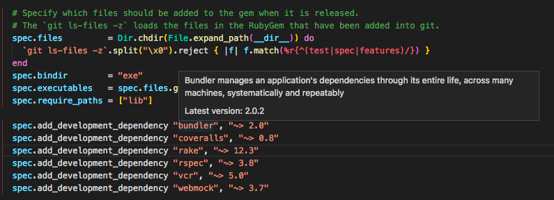

# vscode-gem-lens

A VS Code extension to show the latest version of each gem in a gemspec.

## Install

[How to install VS Code extensions](https://code.visualstudio.com/docs/editor/extension-gallery#_install-an-extension)

## TODO

- Add Gemfile support.
